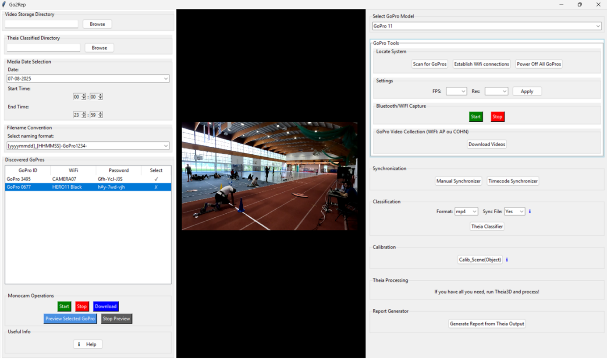

# Go2Rep
Go2Rep is a GUI for multi-GoPro HERO (tested on GoPro 11/13) video collection and processing (COHN or BLE+AP). It supports camera control, video sync, Theia classification, calibration, and report generation—built for markerless 3D motion capture using wireless GoPro workflows.

Go2Rep provides a unified interface for controlling multiple GoPro HERO cameras (tested on HERO11 and HERO13) over wireless connections.  
It handles the full workflow from discovery and connection to recording, downloading, and organizing videos.  
The application automatically adapts its communication method based on the camera model, ensuring the correct protocol is used for reliable control and media transfer.

Key capabilities include:
- **Camera discovery** via Bluetooth or COHN
- **Connection management** for one or more GoPros
- **Recording controls** (start/stop, FPS, resolution)
- **Automatic media collection** with proper handling of encrypted downloads
- **Model-specific workflows** to match protocol and provisioning requirements

---
            

  <table border="1" cellspacing="0" cellpadding="6" style="display: inline-table;">
  <thead>
    <tr>
      <th>Feature</th>
      <th>GoPro 11 or older</th>
      <th>GoPro 13 / 12</th>
    </tr>
  </thead>
  <tbody>
    <tr>
      <td><strong>Protocols Used</strong></td>
      <td>BLE + WiFi AP</td>
      <td>HTTPS via COHN</td>
    </tr>
    <tr>
      <td><strong>Certificate Provisioning</strong></td>
      <td>❌ Not Required</td>
      <td>✅ Required</td>
    </tr>
    <tr>
      <td><strong>Preview &amp; Streaming</strong></td>
      <td>Supported via WiFi AP</td>
      <td>Supported via COHN*</td>
    </tr>
    <tr>
      <td><strong>Media Download</strong></td>
      <td>Basic via BLE + WiFi</td>
      <td>Encrypted via HTTPS</td>
    </tr>
  </tbody>
</table>

