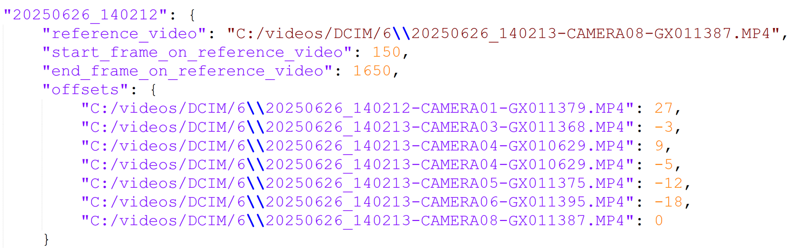
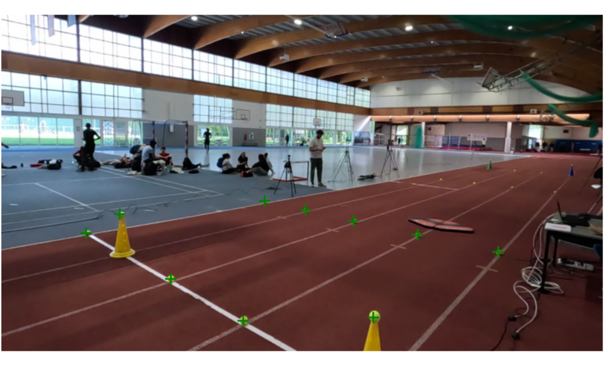
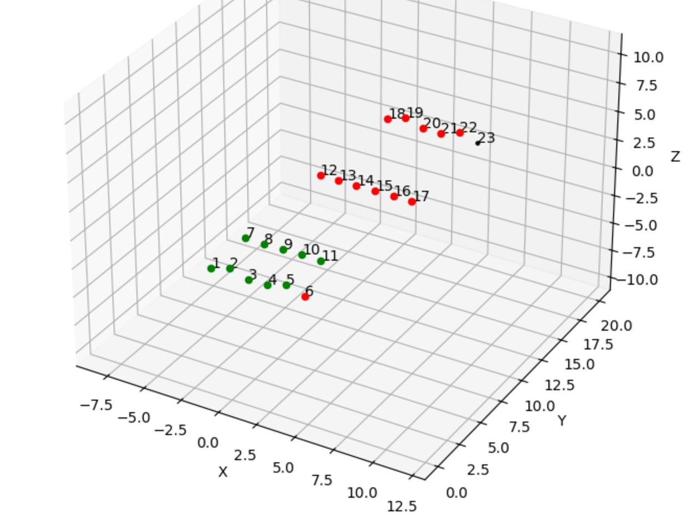

# Go2Rep
Go2Rep is a GUI for multi-GoPro HERO (tested on GoPro 11/13) video collection and processing (COHN or BLE+AP). It supports camera control, video sync, Theia classification, calibration, and report generation—built for markerless 3D motion capture using wireless GoPro workflows.


# 0. Installation

## Installation via Anaconda

1. Click on the installation link: [XXXX] (Replace this with your actual link.)

2. Add Go2Rep to your Anaconda environment:
   - Navigate to:  
     `C:\ProgramData\anaconda3\envs\`
   - Locate your environment folder (e.g., `Go2Rep`).
   - Ensure that Go2Rep is properly placed in:  
     `C:\ProgramData\anaconda3\envs\Go2Rep\Lib\site-packages\Go2Rep`

3. Launch the GUI:
   - Open the terminal or Anaconda Prompt.
   - Navigate to the folder:  
     ```bash
     cd C:\ProgramData\anaconda3\envs\Go2Rep\Lib\site-packages\Go2Rep
     ```
   - Activate Go2Rep environment:  
     ```bash
     conda activate Go2Rep
     ```
   - Run the following command:  
     ```bash
     python main_gui.py
     ```

## Download the Example Project

If you want, you can download the Go2Rep example by clicking on this link (replace XXX with your actual download link):  
[Download link: XXX]

After downloading, extract and place the contents into the following directory:  
`C:\ProgramData\anaconda3\envs\Go2Rep\Lib\site-packages\Go2Rep\Example_Go2Rep`

---

## Troubleshooting of Anaconda Installation

### Problem 1  
**'python' is not recognized as an internal or external command**

**Cause:**  
Python is either not installed or its path is not added to the system’s PATH variable.

**Solution:**

**Step 1: Check if Python is installed**  
Open CMD and type:  
```bash
python --version
```
If you get `'python' is not recognized`, proceed to the next step.

2. **Install Python**  
Download Python from [https://www.python.org/downloads/](https://www.python.org/downloads/)  
During installation, **make sure to check the box:**  
> Add Python to PATH  
before clicking **Install Now**.

3. **Add Python to PATH manually (if needed)**  
- Open:  
  `Control Panel > System > Advanced system settings > Environment Variables`  
- Under **System variables**, select **Path** and click **Edit**.  
- Click **New** and add the folder path where `python.exe` is installed, for example:  
  ```
  C:\ProgramData\anaconda3
  python --version
  ```
4. **Restart Command Prompt and verify**  
- Run:    
  `Control Panel > System > Advanced system settings > Environment Variables`  
- Under **System variables**, select **Path** and click **Edit**.  
- Click **New** and add the folder path where `python.exe` is installed, for example:  
  ```
  C:\ProgramData\anaconda3
  python --version
  ```
### Problem 2: 
**`nvcc compilation failed / Cannot find compiler 'cl.exe' in PATH`**

**Cause:**  
CUDA’s `nvcc` compiler needs the Microsoft C++ compiler (`cl.exe`), which isn’t found in your system PATH.

**Solution:**

1. **Install Visual Studio with C++ Build Tools**  
Download Visual Studio from [https://visualstudio.microsoft.com/](https://visualstudio.microsoft.com/)  
During installation, select the workload:  
> Desktop development with C++

2. **Activate Visual Studio environment variables**  
Open a command prompt and activate your conda environment:
 ```
conda activate Go2Rep
cd C:\ProgramData\anaconda3\envs\Go2Rep\Lib\site-packages\Go2Rep
 ```
Then run the Visual Studio environment setup script: 
 ```
"C:\Program Files\Microsoft Visual Studio\2022\Community\VC\Auxiliary\Build\vcvars64.bat"
 ```
This configures environment variables so `cl.exe` can be found.

3. **Run your GUI script**
     ```bash
     python main_gui.py
     ```
# 1. Features
## 1.1 GoPro Control
Go2Rep provides a unified interface for controlling multiple or mono GoPro HERO cameras (tested on HERO11 and HERO13) over wireless connections.(via BLE,AP and COHN)  
It handles the full workflow from discovery and connection to recording, previewing, downloading, and organizing videos.  
The application automatically adapts its communication method based on the camera model, ensuring the correct protocol is used for reliable control and media transfer.

Key capabilities include:
- **Camera discovery** via Bluetooth 
- **Connection management** (via BLE,AP and COHN)
- **Recording controls** (start/stop, FPS, resolution)
- **Automatic media collection** with proper handling of encrypted downloads
- **Model-specific workflows** to match protocol and provisioning requirements

---
            
<table border="1" cellspacing="0" cellpadding="6" style="margin-left: auto; margin-right: auto; display: block;">
  <thead>
    <tr>
      <th>Feature</th>
      <th>GoPro 11 or older</th>
      <th>GoPro 13 / 12</th>
    </tr>
  </thead>
  <tbody>
    <tr>
      <td><strong>Protocols Used</strong></td>
      <td>BLE + WiFi AP</td>
      <td>HTTPS via COHN</td>
    </tr>
    <tr>
      <td><strong>Certificate Provisioning</strong></td>
      <td>❌ Not Required</td>
      <td>✅ Required</td>
    </tr>
    <tr>
      <td><strong>Preview &amp; Streaming</strong></td>
      <td>Supported via WiFi AP</td>
      <td>Supported via COHN*</td>
    </tr>
    <tr>
      <td><strong>Media Download</strong></td>
      <td>Basic via BLE + WiFi</td>
      <td>Encrypted via HTTPS</td>
    </tr>
  </tbody>
</table>
*Not implemented so far


## 1.2. Synchronization

The synchronization feature aligns multiple videos recorded during the same trial to enable frame-accurate analysis across cameras. It supports two main methods:

### 1.2.1 Manual Synchronization

A GUI-based tool with CUDA acceleration that lets users manually select matching frames across videos. Videos are grouped by timestamped filenames and users pick a reference video, define a frame range, then visually select corresponding frames in other videos to calculate frame offsets. The output is a JSON file listing frame offsets per video. 

**Key points:**

- Requires manual frame selection aided by CUDA video processing.  
- Require videos contain a clear synchronization event.  
- Outputs offsets for temporal alignment of all videos.




### 1.2.2 Timecode Synchronization

An automated method using embedded video metadata (`creation_time` and `timecode`) extracted via `ffprobe`. Videos are grouped by filename timestamps, and synchronization offsets are calculated by comparing each video’s start timecode to the earliest one.

**Key points:**

- Requires videos with accurate embedded timecode metadata (Only recommended for GoPro 12/13).
- Requires scanning the Precision Time QR codes or using time synchronization from GoPro Quik to obtain highly accurate timestamp alignment across cameras. This step ensures sub-frame synchronization precision by leveraging GoPro's Precision Time protocol documented at GoPro Precision Time.
- Outputs JSON and CSV files with frame offsets per video.  
- May suffer from drift and requires careful setup (e.g., GPS off or synced).

## 1.3. Classification

Processes and synchronizes multi-camera trial videos using filename timestamps or an optional synchronization JSON file. The system groups videos into trials based on timing proximity, trims them to ensure frame alignment, and re-encodes them in the selected format (e.g., `.mp4`).

> **Important:**  
> Theia requires all videos in a trial to have the same number of frames and to be re-encoded in a compatible format. This tool ensures that by trimming all videos in each trial to the shortest one, or using synchronization offsets (if provided) and further trimming them to the minimum valid range across all videos before re-encoding.

The input of this module is Folder containing raw videos coming from video storage directory and pptional synchronization JSON file. 
The output is Classified, synchronized, and re-encoded video sets per trial and camera, compatible with Theia requirements.
### Keypoints

- **Optional synchronization:** Applies frame offsets from a synchronization JSON file to align videos temporally.  
- **Trimming:**  
  - Without a synchronization file, videos are trimmed to match the shortest video’s length in the trial.  
  - With a synchronization file, trimming respects the provided frame offsets and defined start/end frame ranges, ensuring precise temporal alignment before further trimming all videos to the minimum valid frame range.  
- **Re-encoding:** Videos are re-encoded in the selected output format to ensure compatibility with Theia.  
- **Output:** Saves synchronized, trimmed, and re-encoded videos in trial- and camera-specific folders ready for Theia analysis.

## 1.4 Calibration

This module automates camera calibration (intrinsic and extrinsic parameters) essential for accurate 3D reconstruction and measurement from video data. It uses OpenCV and provides an interactive GUI for manual confirmation or selection of known 3D scene points, following a workflow similar to [Pose2Sim](https://github.com/perfanalytics/pose2sim) 

### 1.4.1 Calibration Workflow

- **Inputs:**
  - Videos or images showing at least six visible, known 3D scene points
  - `config.toml` with measured 3D points and calibration settings
  - Pre-computed intrinsic parameters file (`Calib.toml`) from Pose2Sim

- **Process:**
  1. User launches calibration from the GUI and selects input/output folders.
  2. The system attempts to detect known points automatically; users can confirm or manually select points via an interactive window.
  3. Manual controls allow adding/removing points and marking points as not visible.
  4. Extrinsic parameters (camera position and orientation) are computed once points are confirmed.
  5. Calibration results are saved as `.toml` and `.qca.txt` files; optionally, a `.trc` file for biomechanical use can be generated.

- **Outputs:**
  - Extrinsic camera parameters for 3D reconstruction
  - Calibration files compatible with Pose2Sim and OpenSim

### Key Features

- Requires user interaction for accurate point matching.
- Depends on quality of calibration points and proper configuration.
- Intrinsic calibration must be provided externally (via Pose2Sim).
- Future improvements include automatic pattern detection and integrated intrinsic calibration.

 

## 1.5 Markerless motion analysis
Currently, this pipeline depends on Theia3D for the 3D pose estimation step. However, to reduce dependency and increase flexibility, it is desirable to develop an in-house markerless motion analysis solution.

For 2D pose estimation, Sport 2D can be utilized, which supports real-time 2D pose analysis(combined with GoPro Preview module). For 3D pose estimation, Pose2Sim is a promising tool. Pose2Sim accepts videos of varying lengths that do not require prior calibration or synchronization.

Since this pipeline generates synchronized videos with an identical number of frames and calibrated cameras, there is an opportunity to optimize Pose2Sim pipeline for this specific context. By leveraging the synchronized and calibrated videos, the Pose2Sim code can be restructured to perform pose estimation, person association, triangulation, and OpenSim simulation all within a single for-loop that iterates over the number of frames across all videos simultaneously.

This optimization would significantly accelerate the Pose2Sim workflow, enabling faster and more efficient markerless 3D pose analysis tailored to synchronized multi-camera data.


