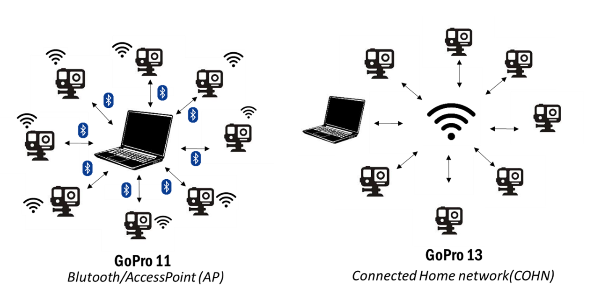

# Go2Rep
Go2Rep is a GUI for multi-GoPro HERO (tested on GoPro 11/13) video collection and processing (COHN or BLE+AP). It supports camera control, video sync, Theia classification, calibration, and report generation—built for markerless 3D motion capture using wireless GoPro workflows.


# 0. Installation

## Installation via Anaconda

1. Click on the installation link: [XXXX] (Replace this with your actual link.)

2. Add Go2Rep to your Anaconda environment:
   - Navigate to:  
     `C:\ProgramData\anaconda3\envs\`
   - Locate your environment folder (e.g., `Go2Rep`).
   - Ensure that Go2Rep is properly placed in:  
     `C:\ProgramData\anaconda3\envs\Go2Rep\Lib\site-packages\Go2Rep`

3. Launch the GUI:
   - Open the terminal or Anaconda Prompt.
   - Navigate to the folder:  
     ```bash
     cd C:\ProgramData\anaconda3\envs\Go2Rep\Lib\site-packages\Go2Rep
     ```
   - Activate Go2Rep environment:  
     ```bash
     conda activate Go2Rep
     ```
   - Run the following command:  
     ```bash
     python main_gui.py
     ```

## Download the Example Project

If you want, you can download the Go2Rep example by clicking on this link (replace XXX with your actual download link):  
[Download link: XXX]

After downloading, extract and place the contents into the following directory:  
`C:\ProgramData\anaconda3\envs\Go2Rep\Lib\site-packages\Go2Rep\Example_Go2Rep`

---

## Troubleshooting of Anaconda Installation

### Problem 1  
**'python' is not recognized as an internal or external command**

**Cause:**  
Python is either not installed or its path is not added to the system’s PATH variable.

**Solution:**

**Step 1: Check if Python is installed**  
Open CMD and type:  
```bash
python --version
```
# 1. Features
## 1.1 GoPro Control
Go2Rep provides a unified interface for controlling multiple or mono GoPro HERO cameras (tested on HERO11 and HERO13) over wireless connections.(via BLE,AP and COHN)  
It handles the full workflow from discovery and connection to recording, previewing, downloading, and organizing videos.  
The application automatically adapts its communication method based on the camera model, ensuring the correct protocol is used for reliable control and media transfer.

Key capabilities include:
- **Camera discovery** via Bluetooth 
- **Connection management** (via BLE,AP and COHN)
- **Recording controls** (start/stop, FPS, resolution)
- **Automatic media collection** with proper handling of encrypted downloads
- **Model-specific workflows** to match protocol and provisioning requirements

---
            
<table border="1" cellspacing="0" cellpadding="6" style="margin-left: auto; margin-right: auto; display: block;">
  <thead>
    <tr>
      <th>Feature</th>
      <th>GoPro 11 or older</th>
      <th>GoPro 13 / 12</th>
    </tr>
  </thead>
  <tbody>
    <tr>
      <td><strong>Protocols Used</strong></td>
      <td>BLE + WiFi AP</td>
      <td>HTTPS via COHN</td>
    </tr>
    <tr>
      <td><strong>Certificate Provisioning</strong></td>
      <td>❌ Not Required</td>
      <td>✅ Required</td>
    </tr>
    <tr>
      <td><strong>Preview &amp; Streaming</strong></td>
      <td>Supported via WiFi AP</td>
      <td>Supported via COHN*</td>
    </tr>
    <tr>
      <td><strong>Media Download</strong></td>
      <td>Basic via BLE + WiFi</td>
      <td>Encrypted via HTTPS</td>
    </tr>
  </tbody>
</table>



## 1.2. Synchronization

The synchronization feature aligns multiple videos recorded during the same trial to enable frame-accurate analysis across cameras. It supports two main methods:

### 1.1.1 Manual Synchronization

A GUI-based tool with CUDA acceleration that lets users manually select matching frames across videos. Videos are grouped by timestamped filenames and users pick a reference video, define a frame range, then visually select corresponding frames in other videos to calculate frame offsets. The output is a JSON file listing frame offsets per video.

**Key points:**

- Requires manual frame selection aided by real-time CUDA video processing.  
- Works best when videos contain a clear synchronization event.  
- Outputs offsets for temporal alignment of all videos.

### 1.1.2 Timecode Synchronization

An automated method using embedded video metadata (`creation_time` and `timecode`) extracted via `ffprobe`. Videos are grouped by filename timestamps, and synchronization offsets are calculated by comparing each video’s start timecode to the earliest one.

**Key points:**

- Requires videos with accurate embedded timecode metadata (recommended for GoPro 12/13).  
- Outputs JSON and CSV files with frame offsets per video.  
- May suffer from drift and requires careful setup (e.g., GPS off or synced).
