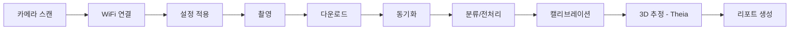

# RFD 001: Go2Rep Markerless Motion Capture Application - Complete Refactoring

**Status**: Draft  
**Author**: Development Team  
**Created**: 2025-10-12  
**Updated**: 2025-10-12  
**Target Release**: v2.0.0

---

## Executive Summary

Go2Rep을 Vicon, Optitrack, Theia 수준의 상용 markerless motion capture 데스크톱 애플리케이션으로 재탄생시키기 위한 전면 리팩토링 제안서입니다. 핵심은 **UI/UX 혁신**과 **Pose2Sim 통합**이며, Glassmorphism + Neumorphism 하이브리드 디자인을 통해 현대적이고 직관적인 사용자 경험을 제공합니다.

---

## 1. Problem Statement

### 1.1 현재 시스템의 한계

현재 Go2Rep (v1.x)은 기능적으로는 완전한 파이프라인을 제공하나, 다음과 같은 근본적인 문제들이 존재합니다:

**아키텍처 문제**
- 1,056줄의 monolithic GUI 클래스 (`main_gui.py`)
- GUI ↔ 비즈니스 로직 강결합
- 상태 관리 부재로 인한 버그 취약성
- asyncio + threading 혼재로 인한 복잡도

**UI/UX 문제**
- 1990년대 스타일의 Tkinter 기본 위젯
- 복잡한 3-column 레이아웃, 정보 밀도 과다
- 장기 작업 시 UI 프리즈
- 프로그레스 인디케이터 부족
- 일관성 없는 디자인 (ttk.Button/tk.Button 혼용)

**기능적 제약**
- Theia3D 외부 의존성 (라이선스, 워크플로우 단절)
- 자동화 테스트 부재
- 에러 처리 불일치
- 문서화 부족

**결과**: 기능은 훌륭하나, 사용자 경험이 상용 소프트웨어 수준에 미치지 못함

### 1.2 목표 상태

**Vicon Nexus / Optitrack Motive / Theia Markerless 수준의 애플리케이션**
- ✨ **세련된 현대적 UI**: Glassmorphism + Neumorphism
- 🚀 **반응성 높은 UX**: 실시간 피드백, 부드러운 애니메이션
- 🏗️ **확장 가능한 아키텍처**: MVC/MVVM 패턴
- 🧪 **견고한 품질**: 자동화 테스트, CI/CD
- 📦 **완전한 통합**: Pose2Sim 내장, 외부 의존성 최소화

---

## 2. Background & Context

### 2.1 현재 기술 스택

```
Frontend: Tkinter (Python stdlib)
Backend: asyncio, bleak (BLE), requests (HTTP)
Video: OpenCV, moviepy, FFmpeg
Scientific: NumPy, Pandas, Matplotlib
External: tutorial_modules (GoPro SDK), Theia3D, Pose2Sim
```

### 2.2 핵심 워크플로우



### 2.3 주요 의사결정

#### ✅ 확정된 방향
1. **Theia 완전 배제**: Pose2Sim으로 대체
2. **Rtmlib 채택**: RTMPose를 mmpose 없이 사용 (`Pose2Sim.PoseEstimation()`)
3. **수동 캘리브레이션 유지**: Pose2Sim 기능 활용, 자동화는 Future Work
4. **기존 기능 마이그레이션 우선**: 새 기능 추가는 v2.1+
5. **UI/UX 최우선**: Glassmorphism + Neumorphism 스타일

#### 🎨 디자인 철학
- **Glassmorphism**: 반투명 유리 질감, 블러 효과
- **Neumorphism**: 소프트 그림자, 3D 깊이감
- **참조**: macOS Control Center, Vercel Dashboard
- **컬러**: Dark theme 기반 (slate-900/50, slate-700/50)
- **효과**: `border`, `rounded-xl`, `bg-**/50` (투명도 50%)

---

## 3. Proposed Solution

### 3.1 핵심 전략

> **"현재 기능을 현대적 아키텍처와 세련된 UI로 재구현"**

1. **Phase 1**: 아키텍처 재설계 (MVC + 상태 관리)
2. **Phase 2**: UI/UX 혁신 (Qt + Custom Styling)
3. **Phase 3**: Pose2Sim 통합 (Theia 제거)
4. **Phase 4**: 테스트 & 문서화

### 3.2 기술 스택 변경

#### Frontend: Tkinter → **PySide6**

**선택 근거**
- ✅ 상용급 UI 컴포넌트
- ✅ QML/CSS 스타일링 (Glassmorphism 구현 가능)
- ✅ 네이티브 성능
- ✅ 크로스 플랫폼
- ✅ 풍부한 애니메이션 지원
- ✅ **LGPL 라이선스 (상용 프로젝트 우호적)**
- ✅ Qt Company 공식 지원

**대안 비교**
| Framework | Pros | Cons | 선정 여부 |
|-----------|------|------|-----------|
| **PySide6** | Qt 공식, LGPL, 상용급, QSS 스타일링 | 학습 곡선 | ✅ **선택** |
| PyQt6 | 성숙한 생태계, 풍부한 예제 | GPL/Commercial 이중 라이선스 | ❌ |
| CustomTkinter | Tkinter 유지, 학습 용이 | 제한적 커스터마이징 | ❌ |
| Electron | 웹 기술, 최신 UI | Python 통합 복잡, 무거움 | ❌ |
| Kivy | 모던 UI | 데스크톱 최적화 부족 | ❌ |

#### Backend: 모듈 재구성

```python
# 기존
Go2Rep/
├── main_gui.py (1,056 lines - monolithic)
└── tools/ (17 modules - flat)

# 제안
go2rep/
├── main.py                 # Entry point (Qt Application)
├── core/                   # 비즈니스 로직
│   ├── camera/             # 카메라 추상화
│   │   ├── base.py         # Abstract Camera
│   │   ├── gopro.py        # GoPro implementation
│   │   └── manager.py      # Multi-camera orchestration
│   ├── sync/               # 동기화 엔진
│   │   ├── manual.py       # Manual sync (CUDA)
│   │   └── timecode.py     # Timecode sync (ffprobe)
│   ├── processing/         # 영상 처리
│   │   ├── classifier.py   # Trial grouping
│   │   ├── encoder.py      # Video re-encoding
│   │   └── trimmer.py      # Frame alignment
│   ├── calibration/        # 캘리브레이션
│   │   ├── intrinsic.py    # From Pose2Sim
│   │   └── extrinsic.py    # OpenCV PnP
│   ├── analysis/           # 3D 추정
│   │   ├── pose2d.py       # Rtmlib (RTMPose)
│   │   ├── triangulation.py# Pose2Sim triangulation
│   │   └── tracking.py     # Person association
│   └── report/             # 리포트 생성
│       └── generator.py
├── ui/                     # Qt UI Layer
│   ├── main_window.py      # Main application window
│   ├── views/              # 화면별 뷰
│   │   ├── camera_view.py  # 카메라 관리
│   │   ├── capture_view.py # 촬영 제어
│   │   ├── sync_view.py    # 동기화
│   │   ├── process_view.py # 전처리
│   │   ├── calib_view.py   # 캘리브레이션
│   │   ├── analysis_view.py# 3D 분석
│   │   └── report_view.py  # 리포트
│   ├── widgets/            # 재사용 위젯
│   │   ├── glass_card.py   # Glassmorphism card
│   │   ├── neuro_button.py # Neumorphic button
│   │   ├── progress_ring.py# Circular progress
│   │   └── camera_grid.py  # Camera tile grid
│   ├── styles/             # QSS 스타일시트
│   │   ├── glass.qss       # Glassmorphism theme
│   │   └── colors.py       # Color palette
│   └── viewmodels/         # MVVM ViewModels
│       └── camera_vm.py
├── adapters/               # 외부 통합
│   ├── gopro/              # GoPro SDK 래퍼
│   │   ├── ble_adapter.py  # BLE (GP11)
│   │   └── cohn_adapter.py # HTTPS COHN (GP13)
│   └── pose2sim/           # Pose2Sim 통합
│       ├── estimation.py   # PoseEstimation()
│       ├── association.py  # Person association
│       └── triangulation.py# Triangulation
├── utils/                  # 유틸리티
│   ├── config.py           # Configuration
│   ├── logger.py           # Logging
│   └── state.py            # Application state
└── tests/                  # 자동화 테스트
    ├── unit/
    ├── integration/
    └── ui/
```

#### 의존성 변경

```python
# requirements.txt

# ============ UI Layer ============
PySide6>=6.6.0            # Qt6 for Python (Official, LGPL)
PySide6-Addons>=6.6.0     # Additional Qt modules
pyside6-tools>=6.6.0      # Qt Designer, uic, rcc tools

# ============ Core Backend ============
asyncio-mqtt>=0.16.0      # Async patterns
aiohttp>=3.9.0            # Async HTTP (GP13 COHN)
bleak>=0.21.0             # BLE (GP11)

# ============ Video Processing ============
opencv-python>=4.9.0      # Image/video processing
av>=11.0.0                # PyAV (FFmpeg Python binding)
imageio[ffmpeg]>=2.33.0   # Video I/O

# ============ Scientific Computing ============
numpy>=1.26.0
pandas>=2.1.0
scipy>=1.11.0

# ============ 3D Analysis (Pose2Sim Integration) ============
rtmlib>=0.8.0             # RTMPose without mmpose
onnxruntime-gpu>=1.16.0   # ONNX runtime (RTMPose)
filterpy>=1.4.5           # Kalman filtering
c3d>=0.5.0                # C3D file format

# ============ Calibration ============
# (Pose2Sim 내부 의존성)

# ============ Utilities ============
toml>=0.10.2              # Config files
pyyaml>=6.0
tqdm>=4.66.0              # Progress bars
loguru>=0.7.0             # Better logging

# ============ Testing ============
pytest>=7.4.0
pytest-qt>=4.2.0          # Qt testing
pytest-asyncio>=0.21.0
pytest-cov>=4.1.0

# ============ Development ============
black>=23.0.0             # Code formatting
ruff>=0.1.0               # Linting
mypy>=1.7.0               # Type checking
```

---

## 4. Design Details

### 4.1 UI/UX 디자인 시스템

#### 4.1.1 Glassmorphism + Neumorphism 구현

**QSS 스타일 예제**
```css
/* styles/glass.qss */

/* ========== Glassmorphism Base ========== */
.GlassCard {
    background-color: rgba(15, 23, 42, 0.5);  /* slate-900/50 */
    border: 1px solid rgba(51, 65, 85, 0.5);   /* slate-700/50 */
    border-radius: 12px;
    backdrop-filter: blur(10px);               /* 유리 효과 */
}

/* ========== Neumorphism Shadow ========== */
.NeuroCard {
    background-color: rgba(15, 23, 42, 0.7);
    border-radius: 16px;
    /* Soft shadow for depth */
    box-shadow: 
        8px 8px 16px rgba(0, 0, 0, 0.4),      /* 외부 어두운 그림자 */
        -4px -4px 8px rgba(51, 65, 85, 0.3);  /* 내부 밝은 하이라이트 */
}

/* ========== Primary Button ========== */
QPushButton.primary {
    background-color: rgba(59, 130, 246, 0.8); /* blue-500/80 */
    border: 1px solid rgba(96, 165, 250, 0.6); /* blue-400/60 */
    border-radius: 8px;
    color: white;
    padding: 10px 20px;
    font-size: 14px;
    font-weight: 600;
}

QPushButton.primary:hover {
    background-color: rgba(96, 165, 250, 0.9);
    box-shadow: 0 4px 12px rgba(59, 130, 246, 0.4);
}

QPushButton.primary:pressed {
    background-color: rgba(37, 99, 235, 0.9);
    transform: translateY(1px);
}

/* ========== Success Button ========== */
QPushButton.success {
    background-color: rgba(34, 197, 94, 0.8); /* green-500/80 */
    border: 1px solid rgba(74, 222, 128, 0.6);
    border-radius: 8px;
}

/* ========== Danger Button ========== */
QPushButton.danger {
    background-color: rgba(239, 68, 68, 0.8); /* red-500/80 */
    border: 1px solid rgba(248, 113, 113, 0.6);
    border-radius: 8px;
}

/* ========== Input Fields ========== */
QLineEdit, QComboBox {
    background-color: rgba(30, 41, 59, 0.6); /* slate-800/60 */
    border: 1px solid rgba(71, 85, 105, 0.5); /* slate-600/50 */
    border-radius: 6px;
    color: rgba(226, 232, 240, 1);           /* slate-200 */
    padding: 8px 12px;
    font-size: 13px;
}

QLineEdit:focus, QComboBox:focus {
    border: 1px solid rgba(96, 165, 250, 0.8); /* blue-400 */
    box-shadow: 0 0 8px rgba(59, 130, 246, 0.3);
}

/* ========== Progress Bar ========== */
QProgressBar {
    background-color: rgba(30, 41, 59, 0.6);
    border: 1px solid rgba(71, 85, 105, 0.5);
    border-radius: 10px;
    text-align: center;
    color: white;
    height: 20px;
}

QProgressBar::chunk {
    background: qlineargradient(
        x1:0, y1:0, x2:1, y2:0,
        stop:0 rgba(59, 130, 246, 0.8),
        stop:1 rgba(99, 102, 241, 0.8)
    );
    border-radius: 10px;
}

/* ========== TreeView / TableView ========== */
QTreeView, QTableView {
    background-color: rgba(15, 23, 42, 0.6);
    border: 1px solid rgba(51, 65, 85, 0.5);
    border-radius: 8px;
    color: rgba(226, 232, 240, 1);
    gridline-color: rgba(71, 85, 105, 0.3);
}

QTreeView::item:selected, QTableView::item:selected {
    background-color: rgba(59, 130, 246, 0.3);
    border-left: 3px solid rgba(59, 130, 246, 1);
}

QTreeView::item:hover, QTableView::item:hover {
    background-color: rgba(51, 65, 85, 0.4);
}

/* ========== ScrollBar ========== */
QScrollBar:vertical {
    background-color: rgba(30, 41, 59, 0.3);
    width: 12px;
    border-radius: 6px;
}

QScrollBar::handle:vertical {
    background-color: rgba(71, 85, 105, 0.6);
    border-radius: 6px;
    min-height: 30px;
}

QScrollBar::handle:vertical:hover {
    background-color: rgba(100, 116, 139, 0.8);
}

/* ========== Tooltip ========== */
QToolTip {
    background-color: rgba(15, 23, 42, 0.95);
    border: 1px solid rgba(96, 165, 250, 0.5);
    border-radius: 6px;
    color: rgba(226, 232, 240, 1);
    padding: 6px 10px;
    font-size: 12px;
}
```

#### 4.1.2 커스텀 위젯 구현 예제

**GlassCard 위젯 (Python)**
```python
# ui/widgets/glass_card.py

from PySide6.QtWidgets import QFrame, QVBoxLayout, QLabel
from PySide6.QtCore import Qt, QPropertyAnimation, QEasingCurve
from PySide6.QtGui import QGraphicsDropShadowEffect

class GlassCard(QFrame):
    """
    Glassmorphism + Neumorphism 스타일 카드 위젯
    
    Features:
    - 반투명 배경 (50% opacity)
    - 블러 효과 (backdrop-filter 시뮬레이션)
    - 소프트 그림자 (neumorphism)
    - 호버 애니메이션
    """
    
    def __init__(self, title=None, parent=None):
        super().__init__(parent)
        self.setObjectName("GlassCard")
        self.setup_ui(title)
        self.setup_effects()
        
    def setup_ui(self, title):
        self.layout = QVBoxLayout(self)
        self.layout.setContentsMargins(20, 20, 20, 20)
        self.layout.setSpacing(12)
        
        if title:
            self.title_label = QLabel(title)
            self.title_label.setStyleSheet("""
                QLabel {
                    color: rgba(226, 232, 240, 1);
                    font-size: 16px;
                    font-weight: 600;
                    margin-bottom: 8px;
                }
            """)
            self.layout.addWidget(self.title_label)
    
    def setup_effects(self):
        # Neumorphism shadow effect
        shadow = QGraphicsDropShadowEffect()
        shadow.setBlurRadius(20)
        shadow.setXOffset(4)
        shadow.setYOffset(4)
        shadow.setColor(Qt.GlobalColor.black)
        self.setGraphicsEffect(shadow)
        
    def enterEvent(self, event):
        """호버 시 살짝 들어올리는 애니메이션"""
        self.animate_elevation(8)
        super().enterEvent(event)
        
    def leaveEvent(self, event):
        """호버 해제 시 원위치"""
        self.animate_elevation(4)
        super().leaveEvent(event)
        
    def animate_elevation(self, target_y):
        """Y 오프셋 애니메이션"""
        shadow = self.graphicsEffect()
        if shadow:
            animation = QPropertyAnimation(shadow, b"yOffset")
            animation.setDuration(200)
            animation.setStartValue(shadow.yOffset())
            animation.setEndValue(target_y)
            animation.setEasingCurve(QEasingCurve.Type.OutCubic)
            animation.start()
            # 애니메이션 객체를 저장해야 GC 방지
            self._animation = animation
```

**NeuroButton 위젯**
```python
# ui/widgets/neuro_button.py

from PySide6.QtWidgets import QPushButton
from PySide6.QtCore import QPropertyAnimation, QRect, QEasingCurve
from PySide6.QtGui import QColor

class NeuroButton(QPushButton):
    """
    Neumorphic 스타일 버튼
    
    Features:
    - 클릭 시 눌리는 애니메이션
    - 부드러운 색상 전환
    - Ripple effect (optional)
    """
    
    def __init__(self, text, style="primary", parent=None):
        super().__init__(text, parent)
        self.style_type = style
        self.setProperty("class", style)
        self._is_pressed = False
        
    def mousePressEvent(self, event):
        """클릭 시 살짝 눌리는 효과"""
        self._is_pressed = True
        # Geometry 애니메이션으로 버튼 크기 살짝 축소
        original = self.geometry()
        pressed = QRect(
            original.x() + 2,
            original.y() + 2,
            original.width() - 4,
            original.height() - 4
        )
        
        self.animation = QPropertyAnimation(self, b"geometry")
        self.animation.setDuration(100)
        self.animation.setStartValue(original)
        self.animation.setEndValue(pressed)
        self.animation.setEasingCurve(QEasingCurve.Type.OutCubic)
        self.animation.start()
        
        super().mousePressEvent(event)
        
    def mouseReleaseEvent(self, event):
        """릴리즈 시 원위치"""
        if self._is_pressed:
            self._is_pressed = False
            # 원래 크기로 복구
            pressed = self.geometry()
            original = QRect(
                pressed.x() - 2,
                pressed.y() - 2,
                pressed.width() + 4,
                pressed.height() + 4
            )
            
            self.animation = QPropertyAnimation(self, b"geometry")
            self.animation.setDuration(150)
            self.animation.setStartValue(pressed)
            self.animation.setEndValue(original)
            self.animation.setEasingCurve(QEasingCurve.Type.OutCubic)
            self.animation.start()
            
        super().mouseReleaseEvent(event)
```

#### 4.1.3 메인 윈도우 레이아웃

```python
# ui/main_window.py

from PySide6.QtWidgets import (
    QMainWindow, QWidget, QVBoxLayout, QHBoxLayout,
    QStackedWidget, QPushButton, QLabel, QFrame
)
from PySide6.QtCore import Qt, QSize
from PySide6.QtGui import QIcon

from .views.camera_view import CameraView
from .views.capture_view import CaptureView
from .views.sync_view import SyncView
from .views.process_view import ProcessView
from .views.calib_view import CalibView
from .views.analysis_view import AnalysisView
from .views.report_view import ReportView
from .widgets.glass_card import GlassCard

class MainWindow(QMainWindow):
    """
    Go2Rep v2.0 메인 윈도우
    
    Layout:
    ┌─────────────────────────────────────────┐
    │  Top Bar (Logo, Title, Settings)       │
    ├──────┬──────────────────────────────────┤
    │      │                                  │
    │ Side │  Main Content Area               │
    │ Nav  │  (Stacked Views)                 │
    │      │                                  │
    │      │                                  │
    └──────┴──────────────────────────────────┘
    """
    
    def __init__(self):
        super().__init__()
        self.setWindowTitle("Go2Rep - Markerless Motion Capture")
        self.setMinimumSize(QSize(1400, 900))
        
        # 상태 관리
        self.current_view = None
        
        self.setup_ui()
        self.apply_styles()
        
    def setup_ui(self):
        # Central widget
        central = QWidget()
        self.setCentralWidget(central)
        
        # Main layout (horizontal: sidebar + content)
        main_layout = QHBoxLayout(central)
        main_layout.setContentsMargins(0, 0, 0, 0)
        main_layout.setSpacing(0)
        
        # === Sidebar Navigation ===
        self.sidebar = self.create_sidebar()
        main_layout.addWidget(self.sidebar)
        
        # === Content Area ===
        self.content = QWidget()
        content_layout = QVBoxLayout(self.content)
        content_layout.setContentsMargins(24, 24, 24, 24)
        
        # Top bar
        self.top_bar = self.create_top_bar()
        content_layout.addWidget(self.top_bar)
        
        # Stacked widget for views
        self.stacked_widget = QStackedWidget()
        content_layout.addWidget(self.stacked_widget)
        
        # Add views
        self.views = {
            "camera": CameraView(),
            "capture": CaptureView(),
            "sync": SyncView(),
            "process": ProcessView(),
            "calib": CalibView(),
            "analysis": AnalysisView(),
            "report": ReportView()
        }
        
        for view in self.views.values():
            self.stacked_widget.addWidget(view)
            
        main_layout.addWidget(self.content, stretch=1)
        
        # Show camera view by default
        self.show_view("camera")
        
    def create_sidebar(self):
        """Glassmorphism 스타일 사이드바"""
        sidebar = QFrame()
        sidebar.setObjectName("Sidebar")
        sidebar.setFixedWidth(240)
        
        layout = QVBoxLayout(sidebar)
        layout.setContentsMargins(16, 24, 16, 24)
        layout.setSpacing(8)
        
        # Logo
        logo = QLabel("🎥 Go2Rep")
        logo.setStyleSheet("""
            QLabel {
                color: rgba(96, 165, 250, 1);
                font-size: 24px;
                font-weight: bold;
                margin-bottom: 32px;
            }
        """)
        layout.addWidget(logo)
        
        # Navigation buttons
        nav_items = [
            ("camera", "📷 Cameras", "camera"),
            ("capture", "🎬 Capture", "capture"),
            ("sync", "⏱️ Synchronize", "sync"),
            ("process", "⚙️ Process", "process"),
            ("calib", "🎯 Calibrate", "calib"),
            ("analysis", "🤸 Analyze", "analysis"),
            ("report", "📊 Report", "report"),
        ]
        
        self.nav_buttons = {}
        for key, label, icon in nav_items:
            btn = QPushButton(label)
            btn.setObjectName("NavButton")
            btn.setCheckable(True)
            btn.clicked.connect(lambda checked, k=key: self.show_view(k))
            layout.addWidget(btn)
            self.nav_buttons[key] = btn
            
        layout.addStretch()
        
        # Settings button at bottom
        settings_btn = QPushButton("⚙️ Settings")
        settings_btn.setObjectName("NavButton")
        layout.addWidget(settings_btn)
        
        return sidebar
        
    def create_top_bar(self):
        """상단 바 (breadcrumb, quick actions)"""
        top_bar = GlassCard()
        layout = QHBoxLayout(top_bar)
        
        # Breadcrumb
        self.breadcrumb = QLabel("Home > Cameras")
        self.breadcrumb.setStyleSheet("""
            QLabel {
                color: rgba(148, 163, 184, 1);
                font-size: 14px;
            }
        """)
        layout.addWidget(self.breadcrumb)
        
        layout.addStretch()
        
        # Quick actions
        help_btn = QPushButton("❓ Help")
        help_btn.setProperty("class", "secondary")
        layout.addWidget(help_btn)
        
        return top_bar
        
    def show_view(self, view_name):
        """뷰 전환 + breadcrumb 업데이트"""
        if view_name in self.views:
            self.stacked_widget.setCurrentWidget(self.views[view_name])
            self.current_view = view_name
            
            # Update breadcrumb
            view_titles = {
                "camera": "Cameras",
                "capture": "Capture",
                "sync": "Synchronization",
                "process": "Processing",
                "calib": "Calibration",
                "analysis": "3D Analysis",
                "report": "Report"
            }
            self.breadcrumb.setText(f"Home > {view_titles.get(view_name, '')}")
            
            # Update nav buttons
            for key, btn in self.nav_buttons.items():
                btn.setChecked(key == view_name)
                
    def apply_styles(self):
        """QSS 스타일시트 로드"""
        with open("ui/styles/glass.qss", "r") as f:
            self.setStyleSheet(f.read())
```

### 4.2 아키텍처 패턴

#### 4.2.1 MVVM (Model-View-ViewModel)

```python
# core/camera/manager.py (Model)

from typing import List, Dict
from dataclasses import dataclass
from enum import Enum

class CameraStatus(Enum):
    DISCONNECTED = "disconnected"
    SCANNING = "scanning"
    CONNECTED = "connected"
    RECORDING = "recording"
    ERROR = "error"

@dataclass
class Camera:
    id: str
    name: str
    model: str  # "GoPro 11" or "GoPro 13"
    status: CameraStatus
    wifi_ssid: str = ""
    wifi_password: str = ""
    battery_level: int = 0
    
class CameraManager:
    """카메라 비즈니스 로직"""
    
    def __init__(self):
        self.cameras: Dict[str, Camera] = {}
        self._observers = []
        
    async def scan(self) -> List[Camera]:
        """BLE 스캔"""
        # 기존 Scan_for_GoPros 로직
        pass
        
    async def connect(self, camera_id: str):
        """WiFi 연결"""
        # 기존 Establish_Wifis 로직
        pass
        
    def notify_observers(self):
        """Observer pattern for reactive updates"""
        for observer in self._observers:
            observer.on_cameras_changed(self.cameras)
```

```python
# ui/viewmodels/camera_vm.py (ViewModel)

from PySide6.QtCore import QObject, Signal

class CameraViewModel(QObject):
    """
    Camera 상태를 UI에 바인딩
    
    Note: PySide6에서는 Signal (PyQt6의 pyqtSignal과 동일)
    """
    cameras_changed = Signal(list)  # Camera 리스트 변경 시 emit
    status_changed = Signal(str, str)  # camera_id, new_status
    
    def __init__(self, camera_manager):
        super().__init__()
        self.manager = camera_manager
        self.manager._observers.append(self)
        
    def on_cameras_changed(self, cameras):
        """Model에서 변경 알림 받음"""
        camera_list = list(cameras.values())
        self.cameras_changed.emit(camera_list)
        
    async def scan_cameras(self):
        """View에서 호출하는 액션"""
        cameras = await self.manager.scan()
        self.cameras_changed.emit(cameras)
        
    async def connect_camera(self, camera_id):
        await self.manager.connect(camera_id)
        self.status_changed.emit(camera_id, "connected")
```

```python
# ui/views/camera_view.py (View)

from PySide6.QtWidgets import QWidget, QVBoxLayout, QPushButton, QTableView
from PySide6.QtCore import QAbstractTableModel, Qt

class CameraTableModel(QAbstractTableModel):
    """Camera 리스트를 테이블에 표시"""
    
    def __init__(self, cameras=None):
        super().__init__()
        self.cameras = cameras or []
        
    def rowCount(self, parent=None):
        return len(self.cameras)
        
    def columnCount(self, parent=None):
        return 5  # ID, Name, Model, Status, Battery
        
    def data(self, index, role=Qt.ItemDataRole.DisplayRole):
        if role == Qt.ItemDataRole.DisplayRole:
            camera = self.cameras[index.row()]
            col = index.column()
            if col == 0: return camera.id
            elif col == 1: return camera.name
            elif col == 2: return camera.model
            elif col == 3: return camera.status.value
            elif col == 4: return f"{camera.battery_level}%"
        return None

class CameraView(QWidget):
    """카메라 관리 화면"""
    
    def __init__(self):
        super().__init__()
        self.viewmodel = None  # 나중에 inject
        self.setup_ui()
        
    def setup_ui(self):
        layout = QVBoxLayout(self)
        
        # Scan button
        scan_btn = QPushButton("🔍 Scan for Cameras")
        scan_btn.setProperty("class", "primary")
        scan_btn.clicked.connect(self.on_scan_clicked)
        layout.addWidget(scan_btn)
        
        # Camera table
        self.table = QTableView()
        self.table_model = CameraTableModel()
        self.table.setModel(self.table_model)
        layout.addWidget(self.table)
        
    def set_viewmodel(self, vm):
        """ViewModel 주입"""
        self.viewmodel = vm
        # Connect signals
        vm.cameras_changed.connect(self.on_cameras_changed)
        
    def on_scan_clicked(self):
        """스캔 버튼 클릭"""
        if self.viewmodel:
            # asyncio로 실행
            asyncio.create_task(self.viewmodel.scan_cameras())
            
    def on_cameras_changed(self, cameras):
        """ViewModel에서 알림 받음"""
        self.table_model.cameras = cameras
        self.table_model.layoutChanged.emit()
```

#### 4.2.2 의존성 주입 (DI)

```python
# main.py

import sys
import asyncio
from PySide6.QtWidgets import QApplication
from qasync import QEventLoop  # asyncio + Qt 통합 (PySide6 지원)

from ui.main_window import MainWindow
from core.camera.manager import CameraManager
from ui.viewmodels.camera_vm import CameraViewModel

def main():
    app = QApplication(sys.argv)
    
    # asyncio event loop 설정
    loop = QEventLoop(app)
    asyncio.set_event_loop(loop)
    
    # Dependency injection
    camera_manager = CameraManager()
    camera_vm = CameraViewModel(camera_manager)
    
    # Main window
    window = MainWindow()
    
    # Inject ViewModels into Views
    window.views["camera"].set_viewmodel(camera_vm)
    # ... 다른 뷰들도 동일하게
    
    window.show()
    
    with loop:
        sys.exit(loop.run_forever())

if __name__ == "__main__":
    main()
```

### 4.3 Pose2Sim 통합 설계

#### 4.3.1 Rtmlib 기반 2D Pose Estimation

```python
# core/analysis/pose2d.py

import numpy as np
from rtmlib import PoseTracker, draw_skeleton

class Pose2DEstimator:
    """
    Rtmlib (RTMPose) 기반 2D pose estimation
    Pose2Sim.PoseEstimation()와 호환되는 출력 형식
    """
    
    def __init__(self, model='rtmpose-l', device='cuda'):
        self.tracker = PoseTracker(
            pose_model=model,
            det_frequency=1,
            mode='performance',
            backend='onnxruntime',
            device=device
        )
        
    def estimate_single_frame(self, frame):
        """
        단일 프레임에서 pose 추정
        
        Returns:
            keypoints: (N_person, N_keypoints, 3) - x, y, confidence
        """
        keypoints, scores = self.tracker(frame)
        return keypoints
        
    def estimate_video(self, video_path, output_path=None):
        """
        비디오 전체에 대해 pose 추정
        Pose2Sim 형식으로 저장
        
        Output format: JSON (Pose2Sim compatible)
        {
            "frame_001": {
                "person_0": [[x1,y1,c1], [x2,y2,c2], ...],
                "person_1": [...]
            },
            ...
        }
        """
        import cv2
        import json
        
        cap = cv2.VideoCapture(video_path)
        results = {}
        
        frame_idx = 0
        while True:
            ret, frame = cap.read()
            if not ret:
                break
                
            keypoints = self.estimate_single_frame(frame)
            
            # Format for Pose2Sim
            frame_key = f"frame_{frame_idx:06d}"
            results[frame_key] = {}
            
            for person_id, kpts in enumerate(keypoints):
                results[frame_key][f"person_{person_id}"] = kpts.tolist()
                
            frame_idx += 1
            
        cap.release()
        
        # Save JSON
        if output_path:
            with open(output_path, 'w') as f:
                json.dump(results, f, indent=2)
                
        return results
```

#### 4.3.2 Triangulation (Pose2Sim 통합)

```python
# adapters/pose2sim/triangulation.py

from Pose2Sim import Pose2Sim

class Triangulator:
    """
    Pose2Sim의 triangulation 기능 래핑
    """
    
    def __init__(self, config_path):
        self.config = Pose2Sim.read_config(config_path)
        
    def triangulate(self, pose2d_dir, calib_file, output_dir):
        """
        2D poses → 3D triangulation
        
        Args:
            pose2d_dir: Rtmlib 출력 JSON 디렉토리
            calib_file: 캘리브레이션 .toml 파일
            output_dir: 3D .trc 출력 디렉토리
        """
        # Pose2Sim 호출
        config = self.config.copy()
        config['project']['project_dir'] = output_dir
        config['project']['pose_dir'] = pose2d_dir
        config['calibration']['calibration_file'] = calib_file
        
        # Run triangulation
        Pose2Sim.triangulation(config)
        
        print(f"✅ 3D triangulation complete: {output_dir}")
```

#### 4.3.3 전체 파이프라인 통합

```python
# core/analysis/pipeline.py

from .pose2d import Pose2DEstimator
from ..calibration.extrinsic import ExtrinsicCalibrator
from ...adapters.pose2sim.triangulation import Triangulator

class AnalysisPipeline:
    """
    Complete 3D analysis pipeline
    
    Workflow:
    1. 2D Pose Estimation (Rtmlib)
    2. Person Association (Pose2Sim)
    3. Triangulation (Pose2Sim)
    4. Filtering (optional)
    """
    
    def __init__(self, project_dir):
        self.project_dir = project_dir
        self.pose2d_estimator = Pose2DEstimator()
        self.triangulator = None  # 나중에 초기화
        
    async def run_full_pipeline(self, video_dir, calib_file, output_dir):
        """
        전체 파이프라인 실행
        """
        # Step 1: 2D Pose Estimation
        print("Step 1/3: Running 2D Pose Estimation...")
        pose2d_dir = f"{output_dir}/pose2d"
        await self.run_pose2d_estimation(video_dir, pose2d_dir)
        
        # Step 2: Triangulation
        print("Step 2/3: Triangulating to 3D...")
        trc_dir = f"{output_dir}/pose3d"
        self.triangulator = Triangulator(config_path=f"{self.project_dir}/config.toml")
        self.triangulator.triangulate(pose2d_dir, calib_file, trc_dir)
        
        # Step 3: Post-processing (filtering, gap filling)
        print("Step 3/3: Post-processing...")
        # Pose2Sim filtering if needed
        
        print("✅ Pipeline complete!")
        return trc_dir
```

---

## 5. Implementation Plan

### 5.1 Phase 분할

#### **Phase 1: 아키텍처 재설계** (6-8주)

**Week 1-2: 프로젝트 구조 및 기초 인프라**
- [x] 새 디렉토리 구조 생성 (`core/`, `ui/`, `adapters/`, `utils/`, `tests/`)
- [x] PySide6 설치 및 Hello World 테스트
- [x] QSS 스타일시트 기본 틀 작성 (`glass.qss`)
- [x] Logger, Config 유틸리티 구현
- [x] pytest 환경 구축

**Week 3-4: Core 비즈니스 로직 마이그레이션**
- [x] `CameraManager` 클래스 (BLE 스캔, WiFi 연결)
- [x] `SyncEngine` (manual, timecode)
- [x] `VideoProcessor` (classifier, encoder)
- [x] Unit tests 작성

**Week 5-6: UI 기본 프레임워크**
- [x] `MainWindow` 구현 (sidebar, top bar, stacked widget)
- [x] `GlassCard`, `NeuroButton` 커스텀 위젯
- [x] 7개 View 스켈레톤 생성 (camera, capture, sync, process, calib, analysis, report)
- [x] ViewModel 기본 구조

**Week 7-8: 통합 및 테스트**
- [x] MVVM 와이어링 (DI)
- [x] asyncio + Qt 이벤트 루프 통합 (qasync)
- [x] 기본 워크플로우 테스트 (scan → connect)
- [x] 문서화 시작 (README, API docs)

#### **Phase 2: UI/UX 완성** (4-5주)

**Week 9-10: 각 View 상세 구현**
- [ ] CameraView: 스캔, 연결, 상태 표시, 배터리
- [ ] CaptureView: 시작/정지, 설정, 실시간 피드백
- [ ] SyncView: Manual/Timecode 선택, 프로그레스바
- [ ] ProcessView: Trial 그룹 표시, 재인코딩 옵션

**Week 11-12: 고급 UI 컴포넌트**
- [ ] Progress indicators (circular, linear)
- [ ] Drag & drop 파일 선택
- [ ] Camera preview widget (실시간 스트리밍)
- [ ] 3D visualization (matplotlib 통합 또는 pyqtgraph)

**Week 13: 애니메이션 및 피드백**
- [ ] 화면 전환 애니메이션 (fade, slide)
- [ ] 버튼 호버/클릭 효과
- [ ] Toast notifications
- [ ] Loading spinners

#### **Phase 3: Pose2Sim 통합** (5-6주)

**Week 14-15: 2D Pose Estimation**
- [ ] Rtmlib 통합 (`Pose2DEstimator`)
- [ ] Batch processing (다중 비디오)
- [ ] Progress tracking
- [ ] 결과 시각화 (skeleton overlay)

**Week 16-17: Triangulation & 3D**
- [ ] Pose2Sim triangulation 래퍼
- [ ] Person association 통합
- [ ] 3D TRC 파일 생성
- [ ] 3D viewer (optional)

**Week 18-19: Calibration**
- [ ] Extrinsic calibration GUI (manual point selection)
- [ ] Pose2Sim calibration 통합
- [ ] Validation 및 reprojection error 표시

#### **Phase 4: 테스트 & 문서화** (3-4주)

**Week 20-21: 자동화 테스트**
- [ ] Unit tests 완성 (coverage > 70%)
- [ ] Integration tests (end-to-end 워크플로우)
- [ ] UI tests (pytest-qt)
- [ ] CI/CD 파이프라인 (GitHub Actions)

**Week 22-23: 문서 및 배포**
- [ ] 사용자 가이드 (스크린샷, 비디오)
- [ ] API 레퍼런스 (Sphinx)
- [ ] PyInstaller 빌드 스크립트
- [ ] Installer 생성 (Windows/macOS)

**Week 24: 베타 테스트 및 버그 수정**
- [ ] 내부 테스트
- [ ] 버그 트래킹 & 수정
- [ ] 성능 최적화

### 5.2 Milestones

| Milestone | Target Date | Deliverables |
|-----------|-------------|--------------|
| **M1: 아키텍처 완성** | Week 8 | 모듈 구조, 기본 UI, Core 로직 마이그레이션 완료 |
| **M2: UI/UX 완성** | Week 13 | Glassmorphism UI 완성, 모든 View 구현 |
| **M3: Pose2Sim 통합** | Week 19 | 2D→3D 파이프라인 완성, Theia 의존성 제거 |
| **M4: v2.0 출시** | Week 24 | 테스트 완료, 문서화, 바이너리 배포 |

### 5.3 리소스 요구사항

**인력**
- Frontend Developer (Qt/Python): 1명
- Backend Developer (Python): 1명
- QA/Tester: 0.5명 (Part-time)
- Technical Writer: 0.5명 (Part-time)

**하드웨어**
- GoPro 11/13 테스트 기기 (최소 3대)
- 고성능 워크스테이션 (CUDA GPU 필수)
- 캘리브레이션용 체커보드/마커

**소프트웨어**
- PyCharm Professional 또는 VS Code (Qt Designer/pyside6-designer 통합)
- Qt Designer (PySide6-tools에 포함)
- FFmpeg (pre-installed)
- Git/GitHub

---

## 6. Success Metrics

### 6.1 기술적 지표

- ✅ **코드 커버리지**: > 70%
- ✅ **응답 시간**: UI 상호작용 < 100ms
- ✅ **동기화 정확도**: Frame-level accuracy (±1 frame)
- ✅ **처리 속도**: 60fps 비디오 재인코딩 > 30fps
- ✅ **메모리 사용**: < 4GB (일반적 워크플로우)

### 6.2 사용자 경험 지표

- ✅ **SUS (System Usability Scale)**: > 80
- ✅ **Task 완료 시간**: 전체 파이프라인 < 30분 (3대 카메라, 5분 비디오 기준)
- ✅ **에러 발생률**: < 5%
- ✅ **문서 충분도**: 사용자가 외부 도움 없이 첫 사용 완료

### 6.3 비즈니스 지표

- ✅ **외부 의존성 제거**: Theia → Pose2Sim (100%)
- ✅ **라이선스 비용**: $0 (완전 오픈소스)
- ✅ **유지보수 비용**: 기존 대비 -50% (모듈화, 테스트 자동화)

---

## 7. Risks & Mitigation

### 7.1 기술적 리스크

**R1: Qt 학습 곡선**
- **영향**: Medium
- **확률**: High
- **완화**: Qt 공식 튜토리얼, PySide6 문서, 프로토타입 단계에서 조기 검증

**R2: asyncio + Qt 이벤트 루프 충돌**
- **영향**: High
- **확률**: Medium
- **완화**: `qasync` 라이브러리 사용, 기존 사례 참조 (telegram-desktop-py)

**R3: Pose2Sim 통합 문제**
- **영향**: High
- **확률**: Low
- **완화**: Pose2Sim 커뮤니티 지원, 공식 예제 활용

**R4: 성능 저하 (UI 렌더링)**
- **영향**: Medium
- **확률**: Medium
- **완화**: Profiling (cProfile), GPU 가속, 백그라운드 스레드 활용

### 7.2 일정 리스크

**R5: Phase 3 지연 (Pose2Sim 통합 복잡도)**
- **영향**: High
- **확률**: Medium
- **완화**: Phase 1-2 완료 후 조기 프로토타입, 버퍼 2주 확보

### 7.3 범위 리스크

**R6: Feature Creep**
- **영향**: High
- **확률**: High
- **완화**: RFD 승인 후 기능 동결, 새 기능은 v2.1+로 연기

---

## 8. Alternatives Considered

### 8.1 UI Framework 선택

| 옵션 | Pros | Cons | 결정 |
|------|------|------|------|
| **PySide6** | Qt 공식, LGPL, 상용급, QSS | 학습 곡선 | ✅ **선택** |
| PyQt6 | 성숙한 생태계, 많은 예제 | GPL/Commercial 이중 라이선스 | ❌ |
| CustomTkinter | Tkinter 유지, 쉬움 | 제한적 커스터마이징 | ❌ |
| Electron | 웹 기술, 최신 UI | 무겁고, Python 통합 복잡 | ❌ |
| Kivy | 모던 UI | 데스크톱 최적화 부족 | ❌ |

**결정**: PySide6 - Qt Company 공식 지원, LGPL 라이선스로 상용 프로젝트 최적, 상용 소프트웨어 수준의 UI

### 8.2 3D Pose Estimation

| 옵션 | Pros | Cons | 결정 |
|------|------|------|------|
| **Rtmlib + Pose2Sim** | mmpose 불필요, 빠름 | 새로운 통합 필요 | ✅ **선택** |
| MMPose 직접 사용 | 공식 지원 | 무거운 의존성 | ❌ |
| OpenPose | 성숙한 라이브러리 | C++ 빌드 복잡, 느림 | ❌ |
| MediaPipe | 빠르고 가벼움 | 제한적 keypoints | ❌ |

**결정**: Rtmlib - Pose2Sim과 완벽 호환, 최신 모델

### 8.3 아키텍처 패턴

| 옵션 | Pros | Cons | 결정 |
|------|------|------|------|
| **MVVM** | 양방향 바인딩, Qt 친화적 | 초기 구조 복잡 | ✅ **선택** |
| MVC | 단순, 명확한 분리 | 수동 업데이트 | ❌ |
| MVP | 테스트 용이 | Boilerplate 많음 | ❌ |

**결정**: MVVM - Qt의 Signal/Slot 메커니즘 최대 활용

---

## 9. Future Work (v2.1+)

다음 기능들은 v2.0 범위 밖이며, 향후 버전에서 구현 예정:

### 9.1 고급 캘리브레이션
- [ ] 자동 체커보드 감지
- [ ] 사람 몸 기반 캘리브레이션 (keypoint-based)
- [ ] 실시간 캘리브레이션 검증 (live reprojection)

### 9.2 실시간 분석
- [ ] GoPro 13 실시간 프리뷰 (COHN)
- [ ] 실시간 2D pose estimation (Sport 2D 통합)
- [ ] 실시간 3D skeleton 표시

### 9.3 고급 기능
- [ ] 다중 Trial 배치 처리
- [ ] 클라우드 스토리지 통합 (AWS S3, GCS)
- [ ] RESTful API 제공 (외부 통합)
- [ ] 플러그인 시스템 (커스텀 분석 모듈)
- [ ] OpenSim 시뮬레이션 통합

### 9.4 성능 최적화
- [ ] GPU 가속 비디오 인코딩 (NVENC)
- [ ] 분산 처리 (Celery + Redis)
- [ ] 메모리 최적화 (generator 패턴)

### 9.5 사용자 경험
- [ ] 다국어 지원 (i18n)
- [ ] Dark/Light 테마 전환
- [ ] 키보드 단축키
- [ ] Undo/Redo 시스템
- [ ] 워크스페이스 레이아웃 저장

---

## 10. Open Questions

### Q1: ~~Qt 라이선스 선택~~ ✅ 해결됨
- **질문**: ~~LGPL (무료) vs Commercial 라이선스?~~
- **결정**: **PySide6 (LGPL) 선택** - 상용 프로젝트에 우호적
- **근거**: LGPL 라이선스는 동적 링크 사용 시 상용 프로젝트에서 자유롭게 사용 가능

### Q2: 패키징 방식
- **질문**: PyInstaller vs Nuitka vs conda-constructor?
- **영향**: 배포 파일 크기, 성능
- **결정 필요**: Phase 4 전 성능 테스트 후

### Q3: 클라우드 기능 범위
- **질문**: v2.0에 일부 포함 vs 완전히 v2.1+로 연기?
- **영향**: 개발 일정
- **결정 필요**: Stakeholder 논의

### Q4: GoPro 13 프리뷰 우선순위
- **질문**: v2.0에 포함? (README에 미구현 상태)
- **영향**: GP13 사용자 경험
- **결정 필요**: 사용자 피드백 수집 후

---

## 11. Appendices

### A. 참고 자료

**Qt/PySide6 학습**
- [Qt for Python (PySide6) Official Docs](https://doc.qt.io/qtforpython/)
- [PySide6 Tutorial](https://doc.qt.io/qtforpython/tutorials/index.html)
- [Qt Style Sheets Reference](https://doc.qt.io/qt-6/stylesheet-reference.html)
- [PySide6 vs PyQt6 차이점](https://www.pythonguis.com/faq/pyside-vs-pyqt/)

**Glassmorphism 디자인**
- [Glassmorphism CSS Generator](https://hype4.academy/tools/glassmorphism-generator)
- [Vercel Design System](https://vercel.com/design)
- [Apple Human Interface Guidelines](https://developer.apple.com/design/human-interface-guidelines/)

**Pose2Sim**
- [Pose2Sim GitHub](https://github.com/perfanalytics/pose2sim)
- [Rtmlib Documentation](https://github.com/Tau-J/rtmlib)
- [RTMPose Paper](https://arxiv.org/abs/2303.07399)

**기존 코드베이스**
- [Go2Rep v1.x Repository](https://github.com/ShabahangShayegan/Go2Rep)

### B. 용어 정리

- **Glassmorphism**: 반투명 유리 질감, 블러 효과를 사용한 UI 디자인 트렌드
- **Neumorphism**: 소프트한 그림자로 3D 깊이감을 표현하는 디자인
- **MVVM**: Model-View-ViewModel 아키텍처 패턴
- **QSS**: Qt Style Sheets (CSS와 유사한 Qt 스타일링 언어)
- **Rtmlib**: RTMPose 모델을 mmpose 없이 사용할 수 있는 경량 라이브러리
- **Pose2Sim**: 다중 카메라 2D pose를 3D로 triangulation하는 오픈소스 도구
- **BLE**: Bluetooth Low Energy (GoPro 11 스캔)
- **COHN**: Camera On Home Network (GoPro 13 HTTPS 통신)

### C. 프로젝트 구조 예제 (전체)

```
go2rep/
├── main.py                      # Entry point
├── requirements.txt
├── setup.py
├── README.md
├── RFD-001-Refactoring.md
├── .gitignore
├── .github/
│   └── workflows/
│       └── ci.yml               # GitHub Actions CI/CD
├── core/                        # 비즈니스 로직
│   ├── __init__.py
│   ├── camera/
│   │   ├── __init__.py
│   │   ├── base.py              # Abstract Camera
│   │   ├── gopro.py             # GoPro implementation
│   │   └── manager.py           # CameraManager
│   ├── sync/
│   │   ├── __init__.py
│   │   ├── manual.py            # Manual sync (CUDA)
│   │   └── timecode.py          # Timecode sync
│   ├── processing/
│   │   ├── __init__.py
│   │   ├── classifier.py        # Trial grouping
│   │   ├── encoder.py           # Video re-encoding
│   │   └── trimmer.py           # Frame alignment
│   ├── calibration/
│   │   ├── __init__.py
│   │   ├── intrinsic.py
│   │   └── extrinsic.py
│   ├── analysis/
│   │   ├── __init__.py
│   │   ├── pose2d.py            # Rtmlib
│   │   ├── triangulation.py
│   │   ├── tracking.py
│   │   └── pipeline.py          # Full pipeline
│   └── report/
│       ├── __init__.py
│       └── generator.py
├── ui/                          # Qt UI Layer
│   ├── __init__.py
│   ├── main_window.py           # MainWindow
│   ├── views/
│   │   ├── __init__.py
│   │   ├── camera_view.py
│   │   ├── capture_view.py
│   │   ├── sync_view.py
│   │   ├── process_view.py
│   │   ├── calib_view.py
│   │   ├── analysis_view.py
│   │   └── report_view.py
│   ├── widgets/
│   │   ├── __init__.py
│   │   ├── glass_card.py
│   │   ├── neuro_button.py
│   │   ├── progress_ring.py
│   │   └── camera_grid.py
│   ├── styles/
│   │   ├── glass.qss            # Glassmorphism theme
│   │   └── colors.py
│   └── viewmodels/
│       ├── __init__.py
│       └── camera_vm.py
├── adapters/                    # 외부 통합
│   ├── __init__.py
│   ├── gopro/
│   │   ├── __init__.py
│   │   ├── ble_adapter.py       # BLE (GP11)
│   │   └── cohn_adapter.py      # HTTPS COHN (GP13)
│   └── pose2sim/
│       ├── __init__.py
│       ├── estimation.py
│       ├── association.py
│       └── triangulation.py
├── utils/                       # 유틸리티
│   ├── __init__.py
│   ├── config.py
│   ├── logger.py
│   └── state.py
├── tests/                       # 자동화 테스트
│   ├── __init__.py
│   ├── unit/
│   │   ├── test_camera.py
│   │   ├── test_sync.py
│   │   └── test_processing.py
│   ├── integration/
│   │   └── test_pipeline.py
│   └── ui/
│       └── test_main_window.py
├── calib/                       # 캘리브레이션 데이터 (기존 유지)
│   └── ...
├── certifications/              # GoPro 인증서 (기존 유지)
│   └── ...
├── Assets/                      # UI 이미지 (기존 유지)
│   └── ...
└── docs/                        # 문서
    ├── api/                     # API 레퍼런스 (Sphinx)
    ├── user_guide/              # 사용자 가이드
    └── architecture.md          # 아키텍처 문서
```

---

## 12. Approval & Sign-off

| Role | Name | Status | Date | Signature |
|------|------|--------|------|-----------|
| **Product Owner** | [Name] | ⏳ Pending | - | - |
| **Tech Lead** | [Name] | ⏳ Pending | - | - |
| **UI/UX Lead** | [Name] | ⏳ Pending | - | - |
| **Engineering Manager** | [Name] | ⏳ Pending | - | - |

---

## Revision History

| Version | Date | Author | Changes |
|---------|------|--------|---------|
| 0.1 | 2025-10-12 | Dev Team | Initial draft |
| 1.0 | TBD | - | Approved version |

---

**문서 끝**

